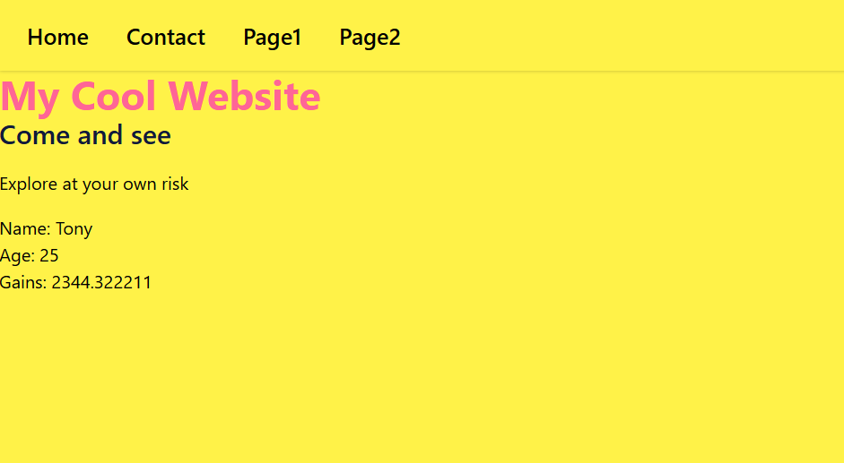
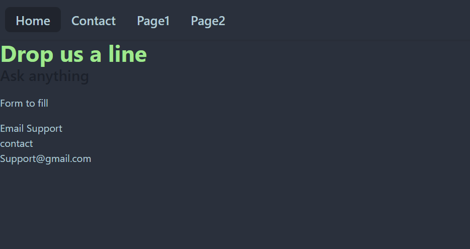
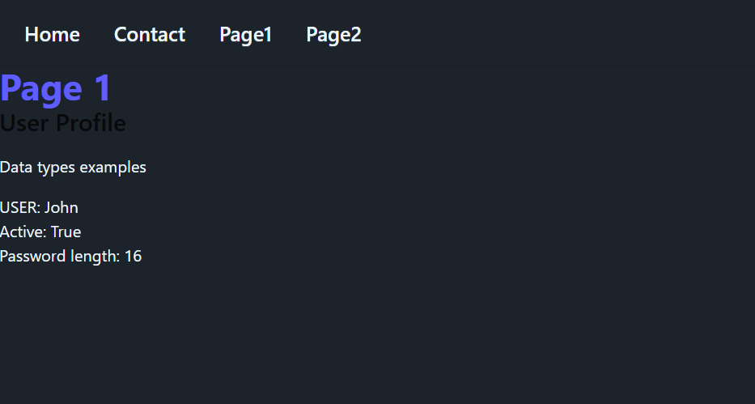
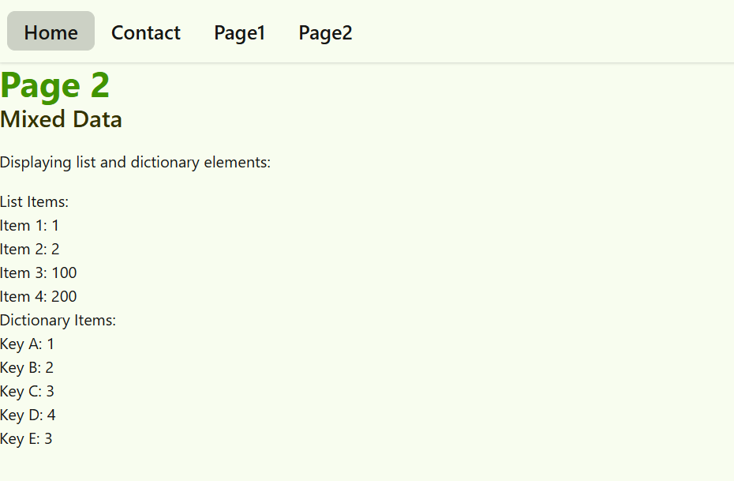

# Static pages with templates and static files

Create 4 webpages with templates (4 + 1 base template), for every page use a different DaisyUI theme.

Submit repo with markdown file with blocks of code for: 
* views.py
* urls.py
* settings.py (All modified sections only)

Include screenshots for every page.

Use only render, for every page add any of these data  in the main block (include name and values for every element using the context dictionary, use loop for iterables):

* 3 variables with different data types
* a list of mixed data types of length 6
* a dictionary with string keys and different data types  values of length 5

--------------------------------------------------------

##  Screenshots

### Home Page

### Contact Page

### Page 1 

### Page 2 

-----------------------------------------------------------
